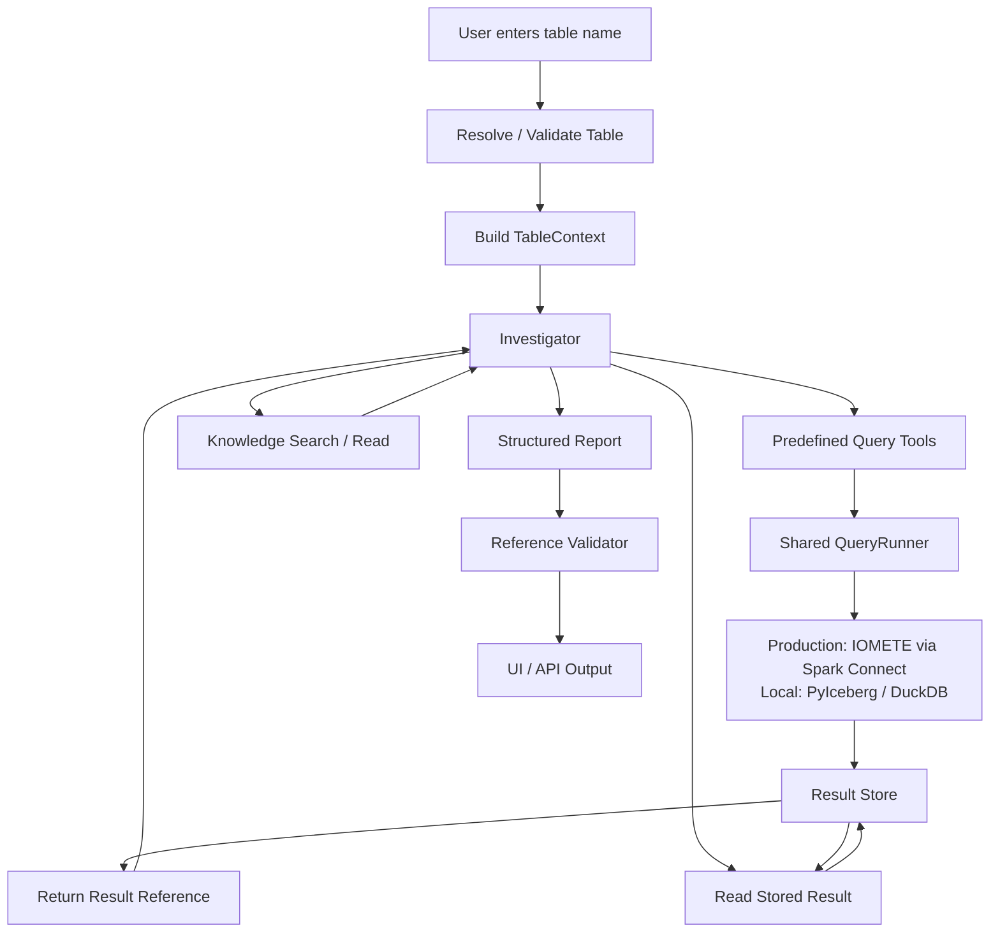
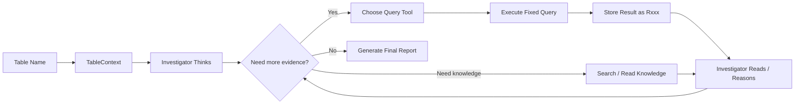
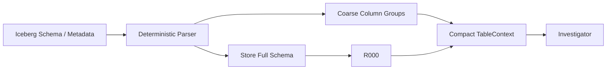
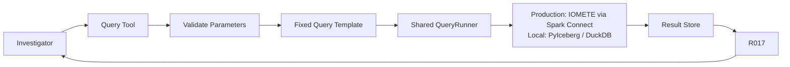
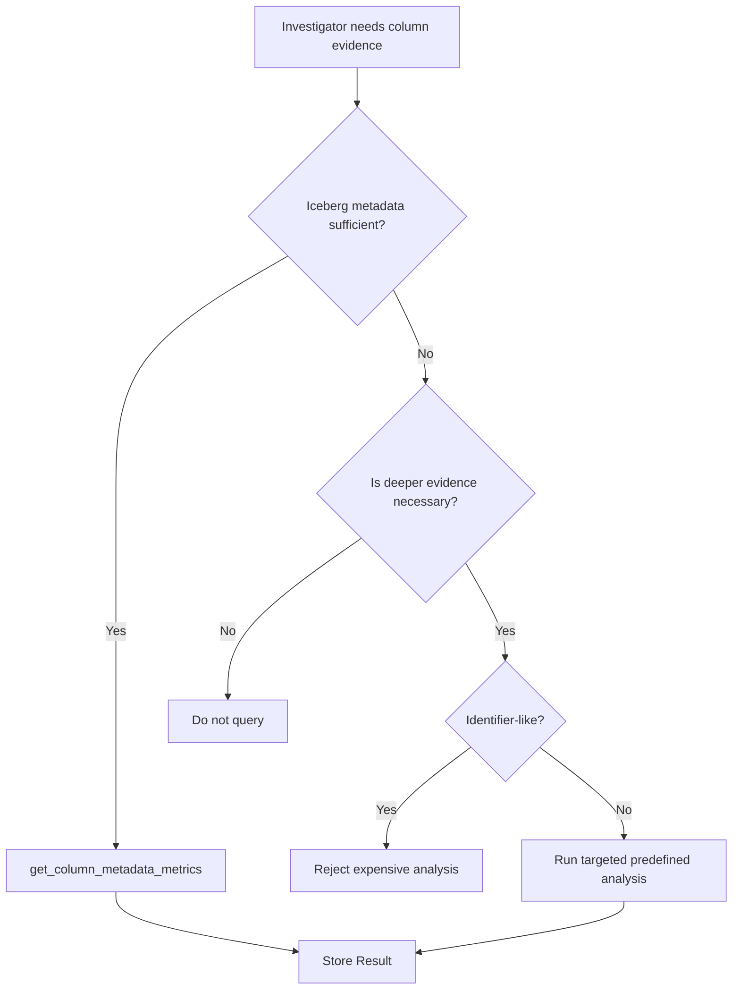
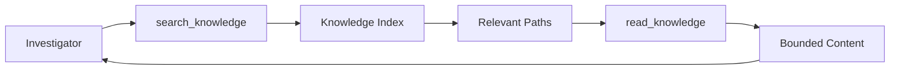
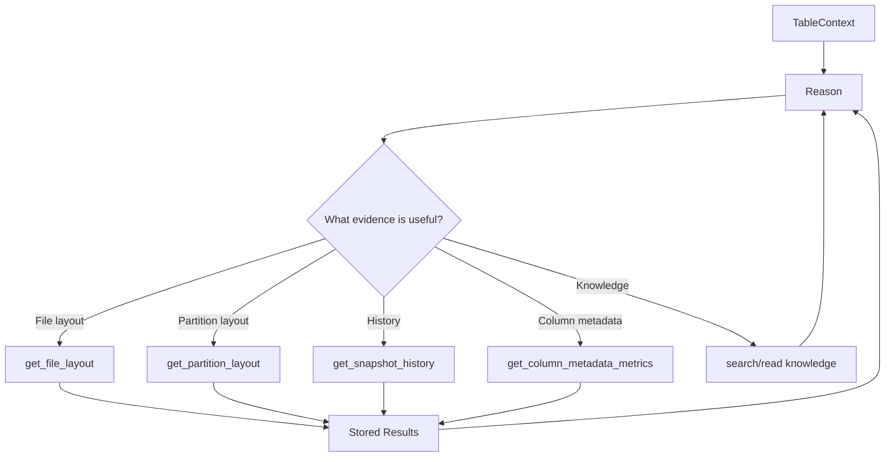
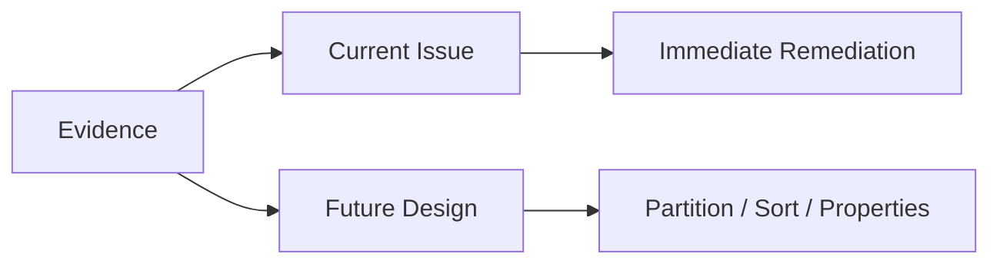

# Smart Table Analyzer — Architecture

**Status:** Final target architecture for MVP  
**Product:** Smart Table Analyzer (STA)  
**Primary platform:** Apache Iceberg on IOMETE / Spark  
**Architecture style:** Single autonomous Investigator + deterministic query tools + persistent result store + curated knowledge

---

# 1. Product Definition

Smart Table Analyzer is an autonomous Iceberg table investigator.

The user does **not** provide:
- a troubleshooting question,
- a hypothesis,
- SQL,
- a list of checks,
- a partition column,
- a requested optimization.

The only user input is the Iceberg table name.

Example:

```text
prod.sales.orders
```

Everything else is supplied by the configured environment:

```text
catalog connection
execution engine
credentials
knowledge repository
team runbooks
query tools
runtime limits
```

STA's built-in mission is:

> Inspect the supplied Iceberg table, discover material problems, investigate likely causes, support conclusions with deterministic query results, and recommend improvements to table design and maintenance configuration when evidence justifies them.

The output covers both:

```text
CURRENT TABLE HEALTH
+
FUTURE TABLE DESIGN
```

including:
- current table issues,
- immediate remediation,
- partition-spec recommendations,
- sort-order recommendations,
- table-property recommendations,
- limitations and missing evidence.

---

# 2. Core Architecture Rule

> **Code measures. Storage remembers. Knowledge informs. The LLM investigates.**

## Deterministic code owns

```text
table connection
Iceberg metadata access
schema extraction
fixed query execution
parameter validation
snapshot consistency
query timeouts
result persistence
result references
credentials
```

## The Investigator owns

```text
what to investigate
which query tool to run
which knowledge to read
interpretation of results
hypothesis formation
comparison of competing explanations
root-cause reasoning
severity
confidence
recommendations
whether no change is appropriate
final report
```

A deterministic tool must never return conclusions such as:

```text
small_files = true
partition_skew = severe
compaction_required = true
recommended_partition = days(created_at)
health_score = 42
```

It may return measurements such as:

```text
file_count = 18342
median_file_size_mb = 39
p90_file_size_mb = 112
partition_count = 941
```

The Investigator decides what those measurements mean.

---

# 3. Non-Goals

STA does not:
- allow the LLM to write SQL,
- execute arbitrary model-generated SQL,
- use a deterministic checklist as the diagnosis engine,
- require the user to ask a question,
- run broad column profiling by default,
- deeply analyze every column,
- analyze identifier columns as partition candidates,
- use workload/query-history analysis in the MVP,
- require vector RAG,
- require a knowledge graph,
- require multi-agent orchestration,
- automatically mutate the table,
- automatically execute compaction or redesign,
- force recommendations when evidence is weak.

`NO CHANGE` and `INCONCLUSIVE` are valid outcomes.

---

# 4. Technology Stack

| Layer | Technology |
|---|---|
| Language | Python 3.12+ |
| API | FastAPI |
| Agent runtime | Pydantic AI |
| Data contracts | Pydantic v2 |
| Iceberg metadata | Production: IOMETE/Spark SQL only (DESCRIBE/SHOW plus metadata tables; no PyIceberg/catalog client); Local: PyIceberg where suitable |
| Production query execution | IOMETE through Spark Connect using reviewed Spark SQL templates |
| Lightweight local analysis | DuckDB where useful |
| Runtime/result persistence | SQLite initially |
| Large result payloads | Filesystem or object storage when necessary |
| Knowledge search | Simple lexical/file search |
| Tracing | Structured logging + Pydantic AI/OpenTelemetry |
| Optional observability | Langfuse |

Use **Pydantic AI core only for the initial MVP**.

Do not pre-build:
```text
generic planning
generic memory
complex checkpointing
conversation search
context compaction
multi-agent orchestration
```

---

# 5. High-Level Architecture



There are five core product components:

```text
1. TableContext
2. Investigator
3. Query Tools + QueryRunner
4. Result Store
5. Knowledge + Report
```

---

# 6. Runtime Lifecycle



Practical loop:

```text
TABLE
→ understand table structure
→ reason
→ choose measurement
→ execute deterministic query
→ store result
→ reason
→ optionally read knowledge/runbook
→ choose next measurement
→ ...
→ report
```

There is no hard-coded diagnostic sequence.

---

# 7. Input Contract

## User input

Exactly one required value:

```text
table_name
```

Example:

```text
catalog.database.orders
```

The user does not need to know:
- which query to run,
- which issue to look for,
- which partition column to test,
- which maintenance setting matters.

## Environment input

Configured by deployment, not entered during each investigation:

```text
catalog
execution endpoint
authentication
allowed namespaces
knowledge location
team runbooks
query timeout
result-size limits
```

## Run context

After table resolution:

```text
RunContext
├── run_id
├── catalog
├── namespace
├── table
├── pinned_snapshot_id
├── connection
└── started_at
```

The model does not supply or modify these values.

---

# 8. TableContext — Startup Context

Before the Investigator's first turn, STA builds a compact deterministic `TableContext`.

This is the only automatic inspection step.

Purpose:

> Give the Investigator enough structural understanding to make good decisions without sending a huge DDL or immediately scanning table data.

Prefer structured Iceberg metadata over table scans. In production this metadata is accessed only through IOMETE/Spark Connect using reviewed Spark SQL metadata queries (DESCRIBE/SHOW plus metadata tables); direct PyIceberg/catalog access is local-only. Textual DDL is fallback/reference when structured metadata is unavailable.

Preserve:

```text
schema_id
field IDs
partition_spec_id
sort_order_id
snapshot_id
format_version
```

## TableContext

```text
TableContext

table
snapshot_id
format_version

schema_summary
column_groups

current_partition_spec
partition_spec_id
partition_spec_history_available

current_sort_order
sort_order_id

relevant_table_properties

metrics_availability

full_schema_ref
```

## Example

```text
TABLE
prod.sales.orders

SNAPSHOT
918278128

FORMAT
Iceberg v2

COLUMNS
identifier-like:
  - order_id
  - customer_id

temporal:
  - created_at
  - updated_at

numeric:
  - amount
  - quantity

string:
  - status
  - region
  - description

boolean:
  - is_active

CURRENT PARTITION SPEC
days(created_at)

CURRENT SORT ORDER
none

METRICS
created_at: bounds + counts available
updated_at: bounds + counts available
status: truncated bounds + counts available

FULL SCHEMA
R000
```

---

# 9. Schema Compression

Raw DDL and wide schemas can consume substantial context.

STA never sends a giant DDL to the Investigator by default.



The startup parser performs only structural classification:

```text
identifier-like
temporal
numeric
string
boolean
binary
complex
other
```

Example:

```text
status STRING
```

is classified as:

```text
string
```

not:

```text
categorical
```

because schema type does not prove cardinality.

---

# 10. Identifier Columns

Identifier-like columns should not trigger expensive partition-candidate analysis in the MVP.

Simple rules are enough:

```text
id
*_id
uuid
*_uuid
guid
*_guid
```

plus optional team-configured exclusions.

Example:

```text
order_id       → identifier-like
customer_id    → identifier-like
event_time     → temporal
status         → string
```

This is an STA MVP policy, not an Iceberg technical limitation.

Do not create a separate policy subsystem. The targeted partition-analysis tool simply rejects identifier-like columns.

---

# 11. Query Tool Philosophy

Query tools are the Investigator's measurement capabilities.

They are not diagnostics.

Each tool:

```text
accepts validated parameters
→ runs predefined SQL/query logic
→ stores raw/structured result
→ returns a result reference
```



## No model SQL

The Investigator never produces SQL.

The SQL exists only in reviewed application code/templates.

Benefits:

```text
predictable behavior
easy testing
safe execution
known cost
stable result schema
no SQL generation/repair loop
no model-driven query injection
```

---

# 12. Shared QueryRunner

All query tools use one execution layer.

Responsibilities:

```text
bind parameters
apply table/snapshot scope
execute reviewed query
enforce timeout
normalize engine types
persist result
record template/query version
return result reference
```

The QueryRunner does not interpret results.

Example query layout:

```text
queries/
├── snapshot_history.sql
├── file_layout.sql
├── file_layout_history.sql
├── partition_layout.sql
├── manifest_stats.sql
├── delete_file_stats.sql
├── column_metadata_metrics.sql
├── partition_candidate_analysis.sql
├── partition_spec_usage.sql
└── sort_order_usage.sql
```

---

# 13. Initial Query Tool Set

Start with a small orthogonal tool vocabulary, roughly 8–12 strong capabilities.

## `get_snapshot_history`

Measures:

```text
snapshot IDs
timestamps
operation
summary metadata
added/removed files where available
added/removed records where available
```

## `get_file_layout`

Measures:

```text
file count
total bytes
min size
percentiles
median
max
record-count distribution
```

## `get_file_layout_history`

Measures file-layout change across relevant snapshots.

## `get_partition_layout`

Measures:

```text
partition count
files per partition
bytes per partition
records per partition
distribution
top/bottom partitions where useful
```

## `get_manifest_stats`

Measures:

```text
manifest count
manifest size
entries
growth characteristics
```

## `get_delete_file_stats`

Measures:

```text
delete-file count
delete-file bytes
delete records where available
distribution
```

## `get_column_metadata_metrics(column)`

Uses Iceberg metadata where available:

```text
value counts
null counts
NaN counts
lower bounds
upper bounds
```

No table scan if metadata is sufficient.

## `analyze_partition_candidate(column)`

Targeted expensive tool.

Rules:

```text
one selected column
identifier-like columns rejected
used only when cheaper metadata is insufficient
predefined query only
```

Returns measurements only.

## `get_partition_spec_usage`

Measures current/historical spec usage where relevant.

## `get_sort_order_usage`

Measures:

```text
configured sort order
file sort_order_id usage
historical/current usage
```

This prevents confusing:

```text
table has sort metadata
```

with:

```text
existing files actually use that sort order
```

## `get_iomete_maintenance_config`

Use only when available.

Returns effective/discoverable maintenance configuration without interpreting it.

---

# 14. Metadata First, Scan Last

Column analysis can be expensive.

STA follows one simple principle:

> Use existing Iceberg metadata before scanning table data.



No generic cost-policy framework is required.

---

# 15. Snapshot Consistency

At run start:

```text
pinned_snapshot_id
```

Every query that can operate against the pinned snapshot should do so.

Every stored result records:

```text
snapshot_id
```

If a query cannot be pinned because of platform limitations, mark that explicitly.

Never silently present observations from different table states as one coherent measurement.

---

# 16. Iceberg-Specific Correctness

Fixed templates must account for Iceberg semantics.

## Schema evolution

Use field IDs where relevant.

Do not assume column names alone represent historical field identity.

## Partition evolution

Changing a partition spec affects future writes.

Existing files remain associated with older partition specs until rewritten.

Recommendations must distinguish:

```text
future partition design
```

from:

```text
rewriting existing data
```

## Sort-order evolution

A configured sort order does not prove all existing files use it.

Inspect `sort_order_id` usage when reasoning about current layout.

## Historical metadata tables

Queries using historical `all_*` metadata surfaces must account for the same physical file appearing through multiple snapshots.

Do not count historical rows blindly as unique physical files.

## Metrics mode

Column-level metrics may be incomplete depending on table metrics configuration.

Missing bounds/counts do not mean missing data.

Expose metrics availability in `TableContext`.

---

# 17. Result Store

Every successful deterministic query produces an immutable result ID:

```text
R001
R002
R003
...
```

A query result is the evidence.

Do not add overlapping domain abstractions like:

```text
Observation
Evidence
Proof
```

unless implementation proves a need.

## QueryResult

```text
result_id
run_id
tool_name
query_version
table
snapshot_id
parameters
schema
row_count
payload_location
executed_at
```

`query_version` identifies the exact reviewed template/implementation that produced the result.

Example:

```text
R017

tool:
get_file_layout

snapshot:
918278128

result:
file_count = 18342
total_size = 682 GiB
median_file_size = 39 MiB
p90_file_size = 112 MiB
```

The Result Store does not decide whether those values are good or bad.

---

# 18. Result Access

The Investigator should not carry every result payload in context.

Model-facing result tools:

```text
list_results()
read_result(result_id, ...)
```

For normal bounded results, `read_result` returns stored data.

For larger results, support pagination/ranges.

The model normally retains references such as:

```text
R003
R007
R012
```

and reads details only when needed.

This controls context growth without a complex memory framework.

---

# 19. Knowledge Repository

Knowledge is curated filesystem content.

```text
knowledge/
├── INDEX.md
├── iceberg/
├── iomete/
└── runbooks/
```

## Iceberg

Explains:

```text
partition transforms
partition evolution
sort orders
snapshots
manifests
delete files
file metrics
compaction
table properties
```

## IOMETE

Explains:

```text
Spark/Iceberg execution
maintenance behavior
catalog behavior
supported features
property precedence
platform constraints
```

## Team runbooks

Authored by the data/platform team.

They define:

```text
preferred file sizes
partition-design preferences
sort-order standards
maintenance conventions
property defaults
exceptions
operational guidance
```

Example:

```text
runbooks/file-sizing.md

preferred data-file range:
256–512 MiB

before recommending compaction:
...

for streaming tables:
...

exceptions:
...
```

---

# 20. Knowledge Access

The Investigator gets only:

```text
search_knowledge(query)
read_knowledge(path/range)
```

No vector database.
No embeddings.
No RAG framework.
No generic web browsing for the MVP.



Knowledge is not table evidence.

Example:

```text
RUNBOOK:
Preferred file size is 256–512 MiB.

R017:
Current median file size is 39 MiB.

INVESTIGATOR:
The current layout materially deviates from the team's preferred file-sizing standard.
```

The conclusion belongs to the Investigator.

---

# 21. Workload Analysis

Workload/query-pattern analysis exists but is deliberately disabled for the MVP.

The Investigator does not receive workload tools.

The run records:

```text
workload_analysis = disabled
```

The report may state once:

> Workload/query-pattern evidence was not part of this run. Partition and sort-order recommendations are based on table structure, table measurements, Iceberg/IOMETE guidance, and team runbooks.

Do not repeatedly search for unavailable workload data.

Future workload evidence can be added as another deterministic tool without changing the architecture.

---

# 22. Investigator

There is one Investigator.

It is a Pydantic AI agent with:

```text
TableContext
query-tool descriptions
result references
knowledge tools
report schema
```

It does not need:

```text
multi-agent delegation
critic agent
separate planner
hypothesis database
candidate queue service
workflow graph
```

## Responsibilities

The Investigator must:

```text
understand table structure
decide what is worth investigating
avoid unnecessary expensive analysis
select measurement tools
read stored results
read relevant knowledge/runbooks
connect multiple pieces of evidence
challenge obvious first conclusions
identify current problems
distinguish symptoms from likely causes
recommend immediate remediation
recommend future table design
state uncertainty
stop when further investigation is unlikely to materially improve the report
```

---

# 23. Investigation Behavior

The system does not prescribe a fixed sequence such as:

```text
small files
→ partition skew
→ manifests
→ deletes
```

Instead:



The tool vocabulary provides measurements, not predefined diagnoses.

---

# 24. Diagnosis

The Investigator can diagnose issues such as:

```text
small-file accumulation
partition fragmentation
unbalanced partition layout
manifest growth
delete-file accumulation
snapshot/metadata growth
maintenance gaps
configuration mismatch
schema/table-design concerns
```

These are examples, not a closed list.

A finding references the stored results that support it.

Example:

```text
Finding:
File layout is substantially smaller than the team target.

Evidence:
R007
R011

Knowledge:
runbooks/file-sizing.md
```

---

# 25. Design Recommendations

A major MVP responsibility is recommending a better future table design.

The Investigator may recommend:

```text
partition spec
sort order
table properties
maintenance changes
```

A recommendation is not mandatory.

`NO CHANGE` is valid.

---

# 26. Partition-Spec Recommendations

STA recommends Iceberg partition specs/transforms, not merely column names.

Examples:

```text
days(event_timestamp)
hours(event_timestamp)
months(event_timestamp)
bucket(32, tenant_key)
truncate(8, region_code)
unpartitioned
```

The MVP intentionally avoids deep partition-candidate analysis for identifier-like columns.

Evidence may include:

```text
current partition spec
partition distribution
file layout by partition
partition evolution
column metadata metrics
one targeted candidate analysis when justified
team runbook guidance
Iceberg transform knowledge
```

A recommended spec describes future layout.

It does not imply historical files automatically change.

The report must make clear when rewriting existing data would be required to realize the new layout for historical files.

---

# 27. Sort-Order Recommendations

The report shows the current sort order, including:

```text
none
```

when no sort order exists.

Recommendation status:

```text
RECOMMENDED
CONSIDER
NO CHANGE
INSUFFICIENT EVIDENCE
```

Because workload analysis is disabled, sort-order recommendations should be conservative unless table evidence and team runbooks provide strong justification.

A sort-order recommendation must not imply that changing metadata automatically rewrites existing files.

It should account for write/distribution trade-offs described in IOMETE/Spark runbooks.

---

# 28. Table-Property Recommendations

STA may recommend table-property changes when supported by table evidence and runbooks.

The model must distinguish:

```text
configuration influencing future writes
```

from:

```text
action required to repair current data layout
```

Example:

```text
CURRENT ISSUE
existing files are very small

IMMEDIATE ACTION
rewrite/compact current files if justified

FUTURE DESIGN
adjust writer/target-file configuration if evidence supports it
```

Changing a property does not retroactively rewrite existing files.

When IOMETE has maintenance overrides or effective configuration layers, prefer effective configuration evidence when available.

If unavailable, say so rather than guessing.

---

# 29. Immediate Remediation vs Future Design



Example:

```text
Current issue:
14,000 undersized files.

Immediate remediation:
Consider rewrite/compaction according to team runbook.

Future design:
Review writer/file-size configuration to reduce recurrence.
```

---

# 30. Report Contract

```text
TABLE
prod.sales.orders

SNAPSHOT
918278128

OVERALL STATUS
Needs Attention

CURRENT ISSUES

1. <finding>
   severity:
   confidence:
   evidence:
   explanation:
   likely cause:

IMMEDIATE REMEDIATION

- action
- evidence
- reason

FUTURE TABLE DESIGN

Partition Spec
  current:
  recommendation:
  status:
  confidence:
  evidence:
  reasoning:
  caveats:

Sort Order
  current:
  recommendation:
  status:
  confidence:
  evidence:
  reasoning:
  caveats:

Table Properties
  property:
  current:
  recommendation:
  evidence:
  reasoning:

NO-CHANGE DECISIONS
  ...

LIMITATIONS
  workload analysis disabled
  unavailable metrics
  unsupported platform metadata
  ...
```

---

# 31. Status Model

## Finding confidence

```text
verified
likely
possible
inconclusive
```

## Severity

```text
critical
high
medium
low
```

## Design recommendation status

```text
recommended
consider
no_change
insufficient_evidence
```

STA is never forced to produce a recommendation.

---

# 32. Report Validation

Do not build a complex deterministic critic.

Validate only what code can reliably validate:

```text
every referenced Rxxx exists
every Rxxx belongs to this run/table
snapshot references are consistent
knowledge references exist AND were actually read in this run
  (derived from the run's persisted knowledge_read events;
   a search hit is not a read)
startup metadata facts cite the record that carries them:
  current partition spec / current sort order cite R000;
  current property values cite R000 or the IOMETE
  maintenance-configuration measurement
every report cites at least one stored measurement (R001+)
  (R000 is the run-scoped full-schema reference, never table evidence)
required fields validate against Pydantic schema
```

Metadata citation typing is a deterministic membership check only: code
verifies that a stated current value points at the stored record that carries
that kind of fact; it never judges whether the stated value itself is correct.

Do not encode deterministic rules attempting to judge whether the LLM's reasoning is correct.

Reasoning quality is evaluated through benchmarks.

---

# 33. Persistence

SQLite is sufficient initially.

Suggested tables:

```text
runs
query_results
reports
events
```

## `runs`

```text
run_id
table
snapshot_id
started_at
completed_at
status
```

## `query_results`

```text
result_id
run_id
tool_name
query_version
snapshot_id
parameters_json
schema_json
row_count
payload / payload_location
executed_at
```

## `reports`

```text
run_id
report_json
created_at
```

## `events`

Only operational events:

```text
agent turn
tool call
tool failure
query duration
result created
report created
```

Do not build event sourcing.

---

# 34. Context Strategy

The model context should contain:

```text
system mission
TableContext
available tools
small result index
recent relevant results
relevant knowledge excerpts
```

Not:

```text
raw giant DDL
entire schema on wide tables
all query payloads
entire knowledge repository
large metadata dumps
every previous execution detail
```

Result references solve most context growth naturally.

If benchmark runs later exceed context limits, add compaction then.

Do not pre-build it.

---

# 35. Error Handling

```text
tool call
→ query execution
→ success: store Rxxx
→ failure: return typed failure
```

Failure includes:

```text
tool
error class
safe message
retryable yes/no
```

One deterministic retry may be allowed for clearly transient execution failures.

Do not create an autonomous query-repair system.

Because SQL is predefined, persistent query failures are implementation/platform issues, not reasoning opportunities.

---

# 36. Security

The LLM never receives:

```text
passwords
tokens
Spark credentials
catalog secrets
raw connection strings
```

The model receives only logical table/runtime context.

Because SQL is predefined:

```text
arbitrary SQL execution = impossible through model tools
```

Tool parameters must still be validated.

The user-supplied table must resolve inside configured allowed catalogs/namespaces.

---

# 37. Package Structure

```text
src/sta/
├── app/
│   ├── api.py
│   └── service.py
│
├── investigator/
│   ├── agent.py
│   ├── prompt.py
│   └── report.py
│
├── context/
│   ├── table_context.py
│   └── schema_map.py
│
├── tools/
│   ├── table_evolution.py
│   ├── file_layout.py
│   ├── partitions.py
│   ├── manifests.py
│   ├── deletes.py
│   ├── columns.py
│   └── maintenance.py
│
├── execution/
│   ├── runner.py
│   └── queries/
│
├── results/
│   ├── models.py
│   └── store.py
│
├── knowledge/
│   ├── search.py
│   └── read.py
│
├── iceberg/
│   ├── metadata.py
│   └── catalog.py
│
└── observability/
    └── tracing.py

knowledge/
├── INDEX.md
├── iceberg/
├── iomete/
└── runbooks/
```

Avoid folders/classes that do not represent real boundaries.

---

# 38. Implementation Boundaries

Do not create:

```text
LegacyAnalyzer
HealthScoreEngine
RecommendationEngine
PartitionRecommendationEngine
CriticAgent
EvidenceManager
HypothesisManager
PlanningEngine
SkillRouter
SQLGenerationAgent
SQLSafetyAgent
ColumnProfiler that scans everything
```

The Investigator is the intelligence.

The rest of STA provides reliable measurements and knowledge.

---

# 39. Query Cost Philosophy

Most investigations should be dominated by metadata queries.

Preference order:

```text
1. startup Iceberg metadata
2. Iceberg metadata-table queries
3. bounded aggregation queries
4. targeted column analysis only when necessary
```

Never:

```text
profile every column first
```

Identifier-like columns are excluded from expensive partition-candidate analysis.

Workload analysis is disabled.

---

# 40. Evaluation

The critical question is:

> Given only a table name, the available deterministic tools, and curated knowledge, does the Investigator reach useful evidence-backed conclusions without unnecessary queries?

Measure:

```text
root-cause correctness
finding usefulness
false positives
unsupported claims
evidence-reference accuracy
partition recommendation quality
sort-order recommendation quality
property recommendation quality
no-change correctness
query count
heavy-query count
runtime
token use
repeated/unnecessary tool calls
```

---

# 41. Benchmark Scenarios

Include:

```text
healthy table
real small-file problem
small files that are not material
partition fragmentation
poor existing partition spec
reasonable existing partition spec
candidate temporal partition improvement
identifier-heavy schema
wide schema
delete-file accumulation
manifest growth
snapshot growth
no sort order where no recommendation is justified
no sort order where runbook/evidence supports a recommendation
incorrect table property
multiple simultaneous issues
missing column metrics
insufficient evidence
```

Critical tests:

```text
Investigator does not run expensive analysis on *_id columns.
Investigator does not scan all columns.
Investigator can recommend NO CHANGE.
Investigator does not mistake generic Iceberg guidance for table evidence.
Investigator distinguishes immediate remediation from future configuration.
```

---

# 42. Future Work — Outside MVP

Later capabilities may include:

```text
workload/query-pattern analysis
IOMETE scan-report evidence
fleet-wide analysis
scheduled analysis
cross-table comparison
automated remediation
write operations
richer persistence/resume
context compaction
additional model providers
additional query tools
```

Each addition should fit the same pattern:

```text
new deterministic measurement
→ stored result
→ Investigator reasons
```

---

# 43. Final Invariants

1. **The only required user input is the Iceberg table name.**
2. STA owns the investigation mission; the user does not provide a diagnostic question.
3. The LLM never writes or executes arbitrary SQL.
4. Query tools execute reviewed predefined queries only.
5. Query tools measure; they never diagnose or recommend.
6. Query results are persisted and referenced by stable IDs.
7. A query result is the evidence; avoid duplicate evidence abstractions.
8. The Investigator performs all interpretation and recommendation reasoning.
9. Knowledge is not evidence.
10. Team runbooks define preferred operational/design practices.
11. Raw DDL is not dumped into model context.
12. Startup `TableContext` is compact and metadata-derived.
13. Schema grouping is structural only; it does not infer data characteristics.
14. Identifier-like columns are excluded from expensive partition-candidate analysis in the MVP.
15. Use Iceberg metadata before scanning table data.
16. Never profile all columns by default.
17. Snapshot consistency is preserved where the platform permits.
18. Partition recommendations are expressed as Iceberg partition specs/transforms.
19. Partition evolution and existing-data rewrite are treated separately.
20. Sort-order definition and actual file sort-order usage are treated separately.
21. Workload analysis is disabled for the MVP and is not silently assumed.
22. Sort-order recommendations are conservative without workload evidence.
23. Immediate remediation and future table design are separate report concepts.
24. A property change is not presented as retroactively fixing existing files.
25. `NO CHANGE` is a successful recommendation.
26. `INCONCLUSIVE` is a successful result when evidence is insufficient.
27. Start with one Investigator.
28. Do not add architectural layers until benchmarks reveal a concrete failure.
29. Pydantic AI is an implementation dependency, not the domain architecture.
30. **Code measures. Storage remembers. Knowledge informs. The LLM investigates.**
