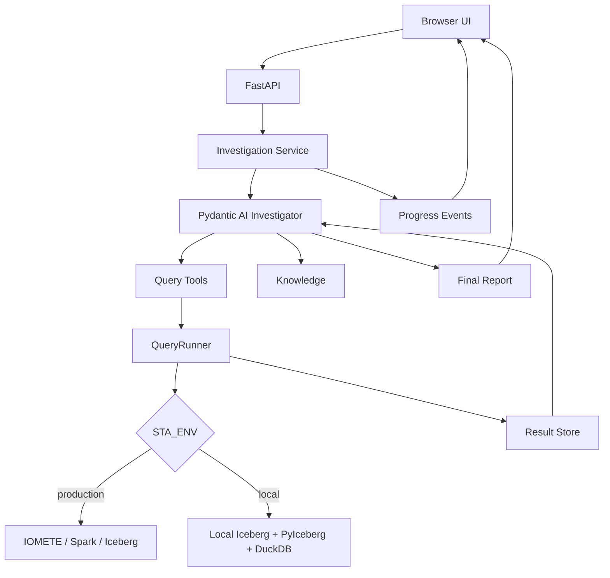
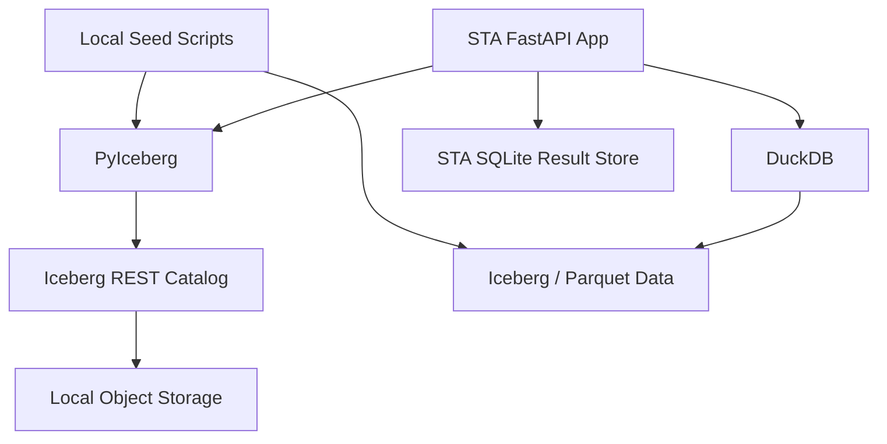
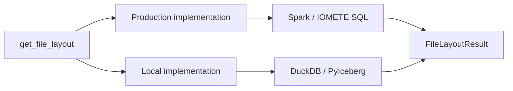
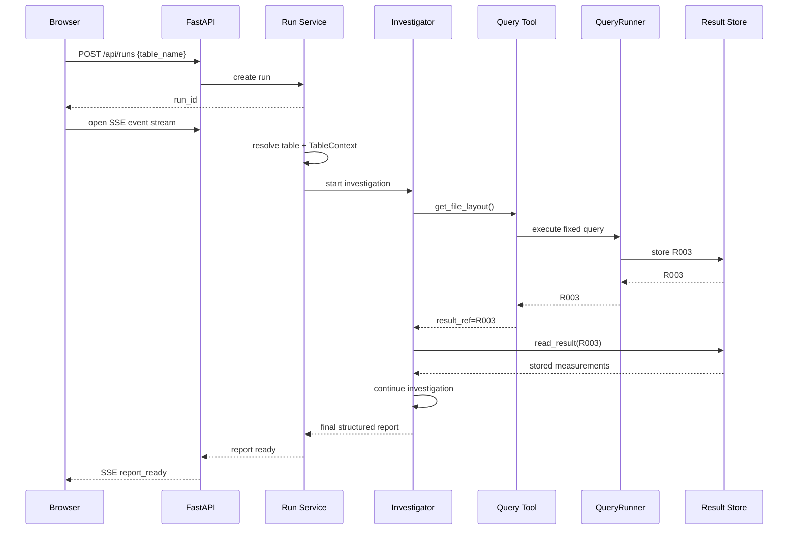

# Smart Table Analyzer — Runtime, Environments, and UI

**Status:** MVP implementation companion to `Architecture.md`  
**Scope:** Production/local data access, runtime execution, API, live progress, and UI  
**Primary rule:** The Investigator and tool contracts remain the same in local and production environments.

---

# 1. Purpose

This document defines how Smart Table Analyzer (STA) runs in:

1. **Production** — Apache Iceberg through IOMETE / Spark.
2. **Local development** — Iceberg running in Docker, PyIceberg for catalog/table operations, and DuckDB for lightweight query execution.

It also defines the MVP UI.

The UI must be:

- simple,
- fast,
- easy to understand,
- transparent about observable system activity,
- robust enough to debug an investigation,
- implemented with plain HTML, CSS, and JavaScript.

This document does not redefine the core investigation architecture.

The core architecture remains:

```text
Table name
    ↓
TableContext
    ↓
Investigator
    ↙        ↘
Query Tools  Knowledge
    ↓
Result Store
    ↓
Investigator
    ↓
Report
```

The only required user input remains:

```text
catalog.schema.table
```

---

# 2. Environment Model

STA supports two runtime modes:

```text
STA_ENV=local
STA_ENV=production
```

The Investigator must not know or care which environment is active.

The environment changes only:

- table/catalog connection,
- metadata reader,
- deterministic query implementation/executor,
- credentials/configuration.

The following remain identical:

```text
Investigator prompt
tool names
tool parameter schemas
tool result schemas
Result Store model
knowledge repository
report schema
UI
API
progress-event model
```

This is critical.

Local development must test the same investigation behavior that production uses.

---

# 3. Environment Architecture



---

# 4. Shared Runtime Contract

The application uses one logical backend contract.

Conceptually:

```python
class TableBackend:
    def resolve_table(table_name): ...
    def build_table_context(table_name): ...
    def execute_query(tool_name, parameters, snapshot_id): ...
```

The exact Python interface may be split internally if implementation benefits from it, but the architecture must remain simple.

There are two implementations:

```text
IometeBackend
LocalIcebergBackend
```

The Investigator never imports or branches on them.

Bad:

```python
if environment == "local":
    agent_use_duckdb_tool()
else:
    agent_use_iomete_tool()
```

Correct:

```text
Investigator
    ↓
get_file_layout()
    ↓
QueryRunner
    ↓
active backend
```

---

# 5. Production Environment — IOMETE

Production source of truth:

```text
IOMETE
+
Apache Iceberg
+
Spark SQL
```

STA runs as an application service and connects to the configured IOMETE environment through Spark Connect. Production does not use direct Iceberg/PyIceberg catalog access; all table and metadata access goes through IOMETE/Spark.

## Production responsibilities

IOMETE provides:

```text
catalog/table access
Iceberg metadata
Spark SQL execution
production table state
production maintenance configuration when accessible
```

STA provides:

```text
Investigator
predefined query tools
query templates
result persistence
knowledge/runbooks
reporting
UI/API
```

---

# 6. Production Connection

Production configuration is supplied through environment/secrets configuration.

Example logical configuration:

```text
STA_ENV=production

IOMETE_ENDPOINT=...        # Spark Connect endpoint
IOMETE_CATALOG=...
IOMETE_TOKEN=...           # IOMETE personal access token / deployment secret
IOMETE_DEFAULT_NAMESPACE=...
```

Exact credential names depend on the final IOMETE connection implementation.

Rules:

- secrets never enter LLM context,
- secrets never appear in progress events,
- secrets never appear in query-result payloads,
- credentials remain inside the backend/connection layer,
- the table requested by the user must resolve inside allowed catalogs/namespaces.

The Investigator sees only:

```text
table
snapshot
schema map
tool results
knowledge
```

---

# 7. Production Query Execution

Production query tools use reviewed Spark/IOMETE-compatible SQL executed through Spark Connect. They do not use PyIceberg, DuckDB, or direct Iceberg catalog clients in production.

Example:

```text
get_file_layout
    ↓
queries/iomete/file_layout.sql
    ↓
IOMETE/Spark Connect
    ↓
normalized result
    ↓
R007
```

The LLM never receives or generates SQL.

The QueryRunner:

```text
loads reviewed template
binds validated parameters
applies table/snapshot scope
executes through IOMETE
normalizes the result
stores it
returns Rxxx
```

---

# 8. Local Development Environment

Local development must avoid Spark.

The local stack is:

```text
Docker Iceberg environment
+
PyIceberg
+
DuckDB
+
STA application
```

Goals:

- lightweight enough for agent-assisted development,
- fast startup,
- deterministic test data,
- no production dependency,
- no Spark requirement,
- realistic Iceberg metadata,
- same STA tool/result contracts as production.

---

# 9. Local Docker Architecture



Recommended Docker services:

```text
Iceberg REST catalog
S3-compatible local object storage
```

For example, MinIO or another compatible local object store may be used.

Do not add services that do not solve a concrete local requirement.

---

# 10. PyIceberg Responsibilities

PyIceberg is used locally for:

```text
catalog connection
table creation
schema access
Iceberg metadata inspection
snapshot metadata
partition specs
sort orders
table properties
test table creation
test data writes where suitable
```

It is also the preferred source for building local `TableContext`.

Example:

```text
local catalog
    ↓
PyIceberg
    ↓
load table
    ↓
schema + snapshot + partition spec + properties
    ↓
TableContext
```

PyIceberg should not become a second reasoning layer.

It only supplies Iceberg facts and local table operations.

---

# 11. DuckDB Responsibilities

DuckDB is the lightweight local analytical engine.

Use it for:

```text
bounded aggregations
column-level targeted analysis
local query-tool implementations
test-data inspection
fast development feedback
```

DuckDB does not need to mimic every Spark SQL detail.

Instead, it must produce the same **tool result contract**.

Example:

```text
Production:
get_file_layout
→ Spark/IOMETE SQL
→ FileLayoutResult

Local:
get_file_layout
→ DuckDB/local implementation
→ FileLayoutResult
```

The SQL syntax may differ internally.

The model-visible result must not.

---

# 12. Local/Production Parity

This is one of the most important implementation rules.

Do not attempt to make DuckDB look syntactically identical to Spark.

STA does not expose SQL to the Investigator anyway.

Therefore parity belongs at the **tool contract**, not SQL-text level.



For every query tool:

```text
same name
same parameters
same semantic meaning
same output schema
same units
same null handling
same snapshot meaning where supported
```

Only implementation differs.

This removes the earlier local-vs-production SQL-syntax problem from the Investigator architecture.

---

# 13. Query Implementation Layout

Keep environment differences explicit.

```text
src/sta/execution/
├── runner.py
├── backends/
│   ├── base.py
│   ├── iomete.py
│   └── local.py
└── queries/
    ├── iomete/
    │   ├── snapshot_history.sql
    │   ├── file_layout.sql
    │   ├── partition_layout.sql
    │   └── ...
    │
    └── local/
        ├── snapshot_history.sql
        ├── file_layout.sql
        ├── partition_layout.sql
        └── ...
```

Not every local capability has to be SQL.

A local tool may use:

```text
PyIceberg metadata
DuckDB SQL
or both
```

while still returning the same Pydantic result type.

---

# 14. Query Contract Tests

Every tool requires backend parity tests.

Example:

```text
get_file_layout
├── production result schema
└── local result schema
```

Contract tests verify:

```text
field names
field types
units
meaning
null semantics
ordering when relevant
result bounds
```

Example invariant:

```text
median_file_size_bytes
```

must mean the same thing locally and in production.

Never create environment-specific interpretation in the Investigator.

---

# 15. Local Test Data

The local Docker environment should include deterministic Iceberg tables created specifically for STA evaluation.

Seed with PyIceberg/scripts.

Minimum examples:

```text
healthy_table
small_files_table
partition_fragmentation_table
poor_partition_design_table
delete_files_table
manifest_growth_table
snapshot_growth_table
wide_schema_table
identifier_heavy_table
no_sort_order_table
```

The data fixtures are not just unit-test data.

They are investigation benchmarks.

---

# 16. Local Startup

Desired developer workflow:

```bash
docker compose up -d
```

then:

```bash
python scripts/seed_local.py
```

then:

```bash
uvicorn sta.app.api:app --reload
```

Then open:

```text
http://localhost:<port>
```

Exact packaging/command details may change during implementation.

The workflow should remain this simple.

---

# 17. No Spark Locally

Local development must not require:

```text
Spark
Spark Connect
large JVM services
IOMETE connectivity
```

Reason:

```text
slow startup
high memory usage
poor agent-development ergonomics
unnecessary local complexity
```

Spark-specific behavior is validated through:

```text
production/staging integration tests
+
tool contract tests
```

not by forcing Spark into the local developer loop.

---

# 18. Application Runtime

The MVP is one FastAPI application.

It owns:

```text
HTTP API
static UI
investigation runs
Pydantic AI Investigator
query tools
knowledge access
Result Store
progress events
report persistence
```

Do not split the MVP into microservices.

---

# 19. Run Execution

A run is created when the user submits a table.



---

# 20. MVP Concurrency

Keep concurrency simple.

For the first MVP:

```text
one FastAPI process
+
one in-process async task per investigation
+
SQLite-backed run/result persistence
```

Do not add:

```text
Celery
Redis queues
Kafka
distributed workers
```

unless real usage proves a need.

The runtime must still enforce a sensible maximum number of simultaneous investigations.

That limit is deployment configuration, not Investigator logic.

---

# 21. Run States

Use a small run-state model:

```text
queued
starting
running
completed
failed
cancelled
```

Optional high-level phase:

```text
building_context
investigating
generating_report
```

Do not create a large workflow state machine.

---

# 22. Progress Visibility

The UI must show what STA is **doing**, not merely a spinner.

Users should be able to see:

```text
table resolution
TableContext creation
Investigator start
tool calls
tool parameters
query execution
query duration
result IDs
result row counts
knowledge searches
knowledge files read
final report generation
errors/retries
```

This progress stream is a first-class product feature.

---

# 23. What Progress Must Not Expose

The UI should expose observable actions, not hidden model chain-of-thought.

Show:

```text
Investigator requested get_file_layout
Tool parameters: snapshot=current
Query started
Query completed in 1.4s
Stored as R004
Investigator read runbooks/file-sizing.md
```

Do not attempt to display unrestricted internal reasoning text.

If useful, the application may emit a short user-facing action note such as:

```text
Checking whether file layout has changed across recent snapshots.
```

This is a concise progress explanation, not hidden reasoning.

---

# 24. Progress Transport — Server-Sent Events

Use **Server-Sent Events (SSE)** for live progress.

Why SSE:

```text
server → browser streaming is the main need
simpler than WebSockets
works naturally with HTTP
easy reconnect behavior
easy vanilla-JS EventSource client
```

The browser starts a run with HTTP and subscribes to events.

```text
POST /api/runs
        ↓
run_id
        ↓
GET /api/runs/{run_id}/events
        ↓
SSE stream
```

WebSockets are unnecessary for the MVP.

---

# 25. Progress Event Contract

All events use one simple envelope:

```json
{
  "event_id": 17,
  "run_id": "run_abc",
  "type": "tool_completed",
  "timestamp": "2026-09-01T10:30:12Z",
  "data": {}
}
```

Events must be ordered per run.

Useful event types:

```text
run_started
table_resolving
table_resolved
table_context_started
table_context_ready

investigator_started

tool_requested
query_started
query_completed
result_stored
tool_failed

result_read

knowledge_search_started
knowledge_search_completed
knowledge_read

report_started
report_ready

run_completed
run_failed
run_cancelled
```

---

# 26. Tool Progress Events

Example:

```json
{
  "type": "tool_requested",
  "data": {
    "tool": "get_file_layout",
    "parameters": {
      "snapshot": "918278128"
    }
  }
}
```

Then:

```json
{
  "type": "query_started",
  "data": {
    "tool": "get_file_layout",
    "query_version": "file_layout:v3"
  }
}
```

Then:

```json
{
  "type": "result_stored",
  "data": {
    "tool": "get_file_layout",
    "result_id": "R007",
    "row_count": 1,
    "duration_ms": 1260
  }
}
```

This gives the user meaningful transparency without coupling the UI to SQL implementation details.

---

# 27. Knowledge Progress Events

Example:

```json
{
  "type": "knowledge_search_completed",
  "data": {
    "query": "target file size compaction",
    "matches": [
      "runbooks/file-sizing.md",
      "iceberg/compaction.md"
    ]
  }
}
```

Then:

```json
{
  "type": "knowledge_read",
  "data": {
    "path": "runbooks/file-sizing.md"
  }
}
```

Do not send entire documents through the progress stream.

---

# 28. Result Details

Every `Rxxx` shown in progress or the final report should be clickable.

Example:

```text
R007 · get_file_layout · 1 row · 1.26s
```

Clicking opens a result-detail panel.

The detail view shows:

```text
result ID
tool
snapshot
parameters
query/template version
execution time
row count
column names
stored raw/structured measurements
```

This makes recommendations auditable.

---

# 29. API Design

Keep the API small.

## Create investigation

```http
POST /api/runs
```

Request:

```json
{
  "table_name": "prod.sales.orders"
}
```

Response:

```json
{
  "run_id": "run_abc",
  "status": "starting"
}
```

## Run status

```http
GET /api/runs/{run_id}
```

## Progress stream

```http
GET /api/runs/{run_id}/events
```

SSE.

## List results

```http
GET /api/runs/{run_id}/results
```

## Read result

```http
GET /api/runs/{run_id}/results/{result_id}
```

## Final report

```http
GET /api/runs/{run_id}/report
```

## Cancel

Optional but useful:

```http
POST /api/runs/{run_id}/cancel
```

No GraphQL is required.

---

# 30. UI Technology

The MVP UI uses only:

```text
HTML
CSS
Vanilla JavaScript
```

Served by FastAPI.

No React.
No Vue.
No Angular.
No frontend build pipeline unless a real need appears.

Suggested layout:

```text
src/sta/ui/
├── index.html
├── styles.css
└── app.js
```

This keeps the product easy to run and modify.

---

# 31. UI Product Goal

The UI has two jobs:

1. Make starting an analysis almost trivial.
2. Make the autonomous investigation understandable while it runs.

The user should never wonder:

```text
Is it stuck?
What is it doing?
Which query is running?
Did that query fail?
What evidence produced this finding?
```

---

# 32. Main UI Layout

```text
┌──────────────────────────────────────────────────────────────┐
│ Smart Table Analyzer                       [LOCAL / IOMETE]  │
├──────────────────────────────────────────────────────────────┤
│ Table                                                      │
│ [ catalog.schema.table_______________________ ] [Analyze]   │
├──────────────────────────────────────────────────────────────┤
│ Run: prod.sales.orders · snapshot 918278128 · Running       │
│                                                              │
│ Progress                                                     │
│ ✓ Table resolved                                             │
│ ✓ TableContext created                                       │
│ ● Investigator running                                       │
│                                                              │
│ Activity                                                     │
│ 10:32:04  Tool requested · get_file_layout                   │
│ 10:32:04  Query running                                      │
│ 10:32:05  Result stored · R007 · 1 row · 1.2s    [View]     │
│ 10:32:07  Knowledge read · runbooks/file-sizing.md           │
│ 10:32:10  Tool requested · get_partition_layout              │
│                                                              │
├──────────────────────────────────────────────────────────────┤
│ Report                                                       │
│                                                              │
│ Appears here when investigation completes.                   │
└──────────────────────────────────────────────────────────────┘
```

---

# 33. UI States

## Idle

Show:

```text
table input
Analyze button
environment badge
```

## Starting

Show:

```text
Resolving table...
```

Disable duplicate submit.

## Running

Show:

```text
table
pinned snapshot
elapsed time
current high-level phase
activity stream
cancel button
```

## Completed

Show:

```text
report
evidence links
run details
activity history
```

## Failed

Show:

```text
clear error
last successful activity
stored results still available
retry/new-run action
```

---

# 34. Environment Badge

Always show the active environment.

Examples:

```text
LOCAL
```

or:

```text
IOMETE
```

This prevents a developer from mistaking local results for production analysis.

In local mode, optionally show:

```text
LOCAL · Docker Iceberg
```

In production:

```text
IOMETE · <configured catalog>
```

Never show secrets.

---

# 35. Progress Timeline

The UI should have a compact high-level timeline:

```text
✓ Table resolved
✓ TableContext ready
● Investigation running
○ Report
```

Do not create 15 workflow phases.

Detailed activity belongs in the activity feed.

---

# 36. Activity Feed

The activity feed is the main runtime transparency surface.

Examples:

```text
11:02:13  Table resolved
11:02:13  Snapshot pinned · 918278128
11:02:14  TableContext ready · 43 columns
11:02:15  Investigator started

11:02:16  Tool · get_file_layout
11:02:17  Result · R003 · 1.1s

11:02:20  Read result · R003
11:02:23  Knowledge search · "file size compaction"
11:02:23  Knowledge read · runbooks/file-sizing.md

11:02:25  Tool · get_snapshot_history
11:02:26  Result · R004 · 0.8s
```

Each tool/result row can expand for details.

---

# 37. Tool Detail Panel

Clicking a tool event opens:

```text
Tool
get_partition_layout

Status
Completed

Parameters
snapshot: 918278128

Query Version
partition_layout:v2

Duration
2.4s

Result
R008

Rows
27

[View R008]
```

Do not show credentials.

Raw predefined SQL does not need to be shown in the normal UI.

If developers later need it, expose template/source details only in an explicit developer/debug view.

---

# 38. Result Viewer

Result viewer supports:

```text
small scalar/key-value results
small tables
paginated larger tables
```

Example:

```text
R008 — get_partition_layout

partition_day | file_count | total_bytes | record_count
--------------------------------------------------------
2026-08-29    | 411        | ...
2026-08-30    | 729        | ...
...
```

The result viewer performs no diagnosis.

It is an audit/debug view of stored measurements.

---

# 39. Final Report UI

The report is the main outcome.

Sections:

```text
Overall Status

Current Issues

Immediate Remediation

Future Table Design
  Partition Spec
  Sort Order
  Table Properties

No-Change Decisions

Limitations
```

Every evidence reference such as:

```text
R003
```

is clickable.

Every knowledge reference such as:

```text
runbooks/file-sizing.md
```

may also be expandable/readable.

---

# 40. Report Evidence UX

Example:

```text
Small-file accumulation
Severity: High
Confidence: Likely

Evidence
[R003] [R006]

Knowledge
[runbooks/file-sizing.md]

Recommendation
...
```

Clicking `R003` opens the exact stored deterministic query result.

This is more useful than adding verbose explanation text everywhere.

---

# 41. UI Design Style

Keep visual design restrained.

Use:

```text
single-column or wide centered layout
clear typography
good spacing
cards only where they add hierarchy
subtle borders
semantic status colors
accessible contrast
responsive layout
```

Avoid:

```text
dashboard clutter
many charts
animated decorations
large sidebars
nested navigation
developer jargon on the main screen
```

The activity feed already provides enough technical depth.

---

# 42. Responsive Behavior

Desktop is the primary MVP target, but the page must still work on smaller screens.

On narrow screens:

```text
table input stacks
activity feed remains full width
tool details open inline/modal
report sections stack vertically
wide result tables scroll horizontally
```

Do not create separate mobile components.

---

# 43. JavaScript Responsibilities

`app.js` should remain small.

Responsibilities:

```text
submit table name
receive run_id
open EventSource
append progress events
update run state
load result details
render final report
handle cancel
handle reconnect/error states
```

No client-side state framework is needed.

The server remains the source of truth.

---

# 44. SSE Reconnection

Browser SSE should support normal EventSource reconnect behavior.

Events have monotonically increasing:

```text
event_id
```

The server should support replaying missed events for the active run when practical.

For the MVP, persisted event history may be read from SQLite before continuing live streaming.

Do not build a distributed event bus.

---

# 45. Event Persistence

Persist lightweight run events:

```text
event_id
run_id
type
timestamp
safe_payload_json
```

Benefits:

```text
reload page without losing progress history
debug failed runs
replay UI activity
audit which tools were called
```

Do not persist hidden model chain-of-thought.

---

# 46. Error UX

Errors must be actionable.

## Invalid table

```text
Table not found:
prod.sales.orderz
```

## IOMETE unavailable

```text
Could not connect to the configured IOMETE environment.
```

## Tool failure

Activity feed:

```text
✕ get_manifest_stats failed
  IOMETE query timed out
```

The Investigator may continue if the missing tool result is non-essential.

## Run failure

Keep:

```text
events
results already collected
error details safe for user
```

Do not replace the page with a generic stack trace.

---

# 47. Local UI Behavior

The same UI is used locally.

Example header:

```text
Smart Table Analyzer     LOCAL · Docker Iceberg
```

A developer can enter:

```text
local.demo.small_files
```

and see the exact same:

```text
TableContext
tool calls
Rxxx results
knowledge reads
report
```

as production.

This is important for realistic end-to-end development.

---

# 48. Production UI Behavior

Production header:

```text
Smart Table Analyzer     IOMETE · production
```

The UI still accepts only:

```text
catalog.schema.table
```

No production credential fields should exist in the normal UI.

No SQL editor should exist.

No "advanced query" input should exist.

---

# 49. Configuration

Suggested configuration shape:

```text
STA_ENV

# common
STA_DB_PATH
STA_KNOWLEDGE_PATH
STA_MAX_CONCURRENT_RUNS
STA_QUERY_TIMEOUT

# production
IOMETE_ENDPOINT
IOMETE_CATALOG
IOMETE_TOKEN

# local
ICEBERG_CATALOG_URI
ICEBERG_WAREHOUSE
S3_ENDPOINT
S3_ACCESS_KEY
S3_SECRET_KEY
```

Actual variable names may change.

Configuration must be validated at startup.

Fail fast if the selected environment is missing required configuration.

---

# 50. Secrets

Local development may use `.env`.

Production should use the deployment platform's secret mechanism.

Rules:

```text
.env is gitignored
tokens never logged
tokens never enter events
tokens never enter Result Store
tokens never enter model context
```

---

# 51. Local Docker Compose

The local Docker stack should remain minimal.

Conceptually:

```yaml
services:
  iceberg-rest:
    ...

  object-storage:
    ...
```

STA itself may run directly from the developer environment during development.

It does not need to be containerized for every code change.

A full app Docker image can still be provided for end-to-end testing.

---

# 52. Local Seeding

Provide one command/script:

```text
scripts/seed_local.py
```

Responsibilities:

```text
create namespace
create benchmark tables
write deterministic data
produce desired snapshots/layout conditions
print created table names
```

Use PyIceberg where practical.

The seed script is test infrastructure, not production application logic.

---

# 53. Local Benchmark Reset

Developers need an easy clean reset.

Example workflow:

```bash
docker compose down -v
docker compose up -d
python scripts/seed_local.py
```

or an equivalent reset script.

A benchmark environment that cannot be recreated reliably will make agent evaluation unreliable.

---

# 54. Testing Strategy

## Unit tests

Test:

```text
schema map
identifier classification
parameter validation
result storage
event serialization
report reference validation
knowledge search/read
```

## Query contract tests

For each tool:

```text
local implementation
production implementation/result fixture
same result contract
```

## Local integration tests

Against Docker Iceberg:

```text
resolve table
build TableContext
run query tools
store Rxxx
read Rxxx
complete an investigation
stream progress events
render report API
```

## UI end-to-end

Test:

```text
enter table
start run
progress appears
tool details appear
results open
report renders
error state works
```

---

# 55. Production Integration Tests

Production/IOMETE integration tests should be separate from the fast local suite.

Validate:

```text
catalog resolution
snapshot handling
query templates
result-schema parity
IOMETE timeout/error behavior
effective maintenance configuration where supported
```

Do not require production connectivity for normal local test runs.

---

# 56. Observability

Backend logs should include:

```text
run_id
table
environment
tool
result_id
query_version
duration
status
```

Do not log secrets.

Example:

```text
run=run_abc tool=get_file_layout result=R007 duration_ms=1260 status=ok
```

This is enough for the MVP.

---

# 57. Performance Targets

The architecture should encourage:

```text
fast TableContext startup
metadata queries first
few heavy queries
bounded result sizes
minimal frontend overhead
live feedback within seconds
```

The UI should emit progress as soon as the table begins resolving.

Users should never wait for the final report before seeing useful activity.

---

# 58. Cancellation

A Cancel button is useful even in the MVP.

Cancellation should:

```text
mark run cancelled
stop future Investigator turns
cancel active query when backend supports it
preserve already stored Rxxx results
preserve activity history
```

Do not delete partial evidence automatically.

---

# 59. Refresh / Reopen

A run URL should be reopenable:

```text
/runs/<run_id>
```

or equivalent client-side routing/query parameter.

Refreshing the page should reload:

```text
run status
past events
existing Rxxx index
final report if available
```

The user should not lose visibility just because the browser refreshes.

---

# 60. Folder Structure Additions

Companion additions to the core architecture:

```text
src/sta/
├── app/
│   ├── api.py
│   ├── runs.py
│   └── events.py
│
├── execution/
│   ├── runner.py
│   ├── backends/
│   │   ├── base.py
│   │   ├── iomete.py
│   │   └── local.py
│   └── queries/
│       ├── iomete/
│       └── local/
│
├── ui/
│   ├── index.html
│   ├── styles.css
│   └── app.js
│
└── ...

scripts/
├── seed_local.py
└── reset_local.py

docker-compose.yml
```

Do not create separate frontend/backend repositories.

---

# 61. MVP Deployment Shape

## Local

```text
Browser
  ↓
FastAPI on developer machine
  ↓
PyIceberg / DuckDB
  ↓
Docker Iceberg catalog + object store
```

## Production

```text
Browser
  ↓
STA application container/service
  ↓
IOMETE backend
  ↓
Production Iceberg
```

Same Investigator.

Same tools.

Same UI.

Same report.

---

# 62. What Must Stay Simple

Do not add for the MVP:

```text
React
frontend bundler
WebSocket infrastructure
Redis
Celery
Kafka
microservices
distributed tracing stack requirement
Kubernetes-specific runtime logic
generic workflow engine
frontend state framework
SQL editor
manual diagnostic controls
```

Every one of these can be added later if a real requirement appears.

---

# 63. End-to-End Example

User enters:

```text
prod.sales.orders
```

UI:

```text
Run started.
```

Backend:

```text
resolve table
pin snapshot 918278128
build compact TableContext
```

UI:

```text
✓ Table resolved
✓ Snapshot pinned · 918278128
✓ TableContext ready · 43 columns
```

Investigator calls:

```text
get_file_layout()
```

UI:

```text
Tool requested · get_file_layout
Query running...
Result stored · R003 · 1 row · 1.2s
```

Investigator reads:

```text
R003
```

Then searches:

```text
file size target compaction
```

UI:

```text
Knowledge search
Knowledge read · runbooks/file-sizing.md
```

Investigator calls:

```text
get_file_layout_history()
```

UI:

```text
Tool requested · get_file_layout_history
Result stored · R004 · 12 rows · 1.8s
```

It may continue with partition/manifests/etc.

Finally:

```text
Report generation started
Report ready
```

The report contains clickable:

```text
R003
R004
runbooks/file-sizing.md
```

At no point does the user supply a diagnostic question or SQL.

---

# 64. Final Runtime Invariants

1. **Production data access is IOMETE/Spark/Iceberg.**
2. **Local development uses Docker Iceberg + PyIceberg + DuckDB; no Spark is required locally.**
3. Local and production share the same Investigator and model-facing tool contracts.
4. Environment differences exist only behind the backend/query implementation boundary.
5. Tool-result schemas, semantics, units, and null handling must match across environments.
6. The user supplies only the table name.
7. The UI uses plain HTML, CSS, and JavaScript.
8. FastAPI serves both API and UI for the MVP.
9. Live progress uses Server-Sent Events.
10. Progress exposes observable activity: tool calls, safe parameters, query state, result IDs, knowledge reads, errors, and report state.
11. Progress does not expose hidden model chain-of-thought.
12. Every `Rxxx` can be opened from the UI.
13. The same UI runs against local and production backends.
14. Raw SQL is not a user-facing input.
15. Production credentials never appear in the UI or model context.
16. SQLite is sufficient for the initial single-instance MVP.
17. Local benchmark data is reproducible through seed/reset scripts.
18. No Spark is added to local development merely for production syntax parity.
19. Parity is enforced at the deterministic tool-result contract.
20. Add distributed infrastructure only after real usage proves it necessary.
